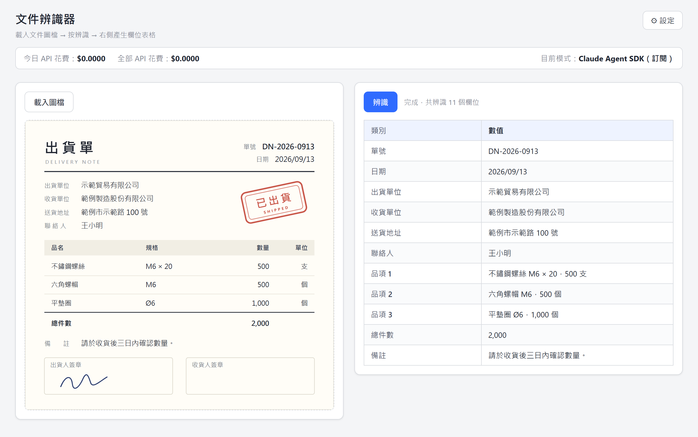
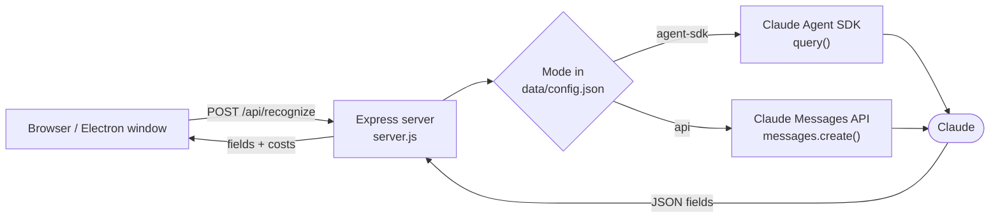
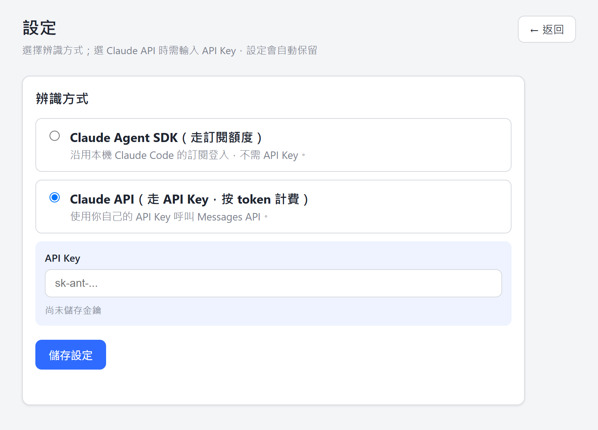

<div align="center">

# 📄 Your DocumentRecognizer

**Snap a document, get a clean field table — powered by Claude.**

Load a photo or scan of a work order, delivery note, invoice or receipt, click **Recognize**,<br>
and every *field : value* pair on the page lands in a tidy table.

**English** · [繁體中文](README.zh-TW.md)

<p>
  
  
  
  
  <a href="LICENSE"></a>
</p>



<sub>Recognizing a sample delivery note (fictional data)</sub>

</div>

## ✨ Features

- **From image to table in one click** — any document photo or scan works: work orders, delivery notes, invoices, receipts…
- **Two ways to reach Claude** — use your Claude subscription through the **Claude Agent SDK**, or your own **API key** through the Messages API. A switch applies from the very next request.
- **Built-in cost meter** — today's and all-time API spend, right in the header.
- **Browser or desktop** — `npm start` for a local web app, `npm run electron` for a desktop window.
- **Keeps your data local** — settings and cost history live in a git-ignored `data/` folder, uploads are deleted right after recognition, and the API key is only ever shown masked.
- **Small and hackable** — Express and vanilla JavaScript with no build step; the whole recognition prompt is a single constant.

## 🧭 How it works



1. The page uploads the image to `/api/recognize` (images only, up to 15 MB), where it is stored temporarily in `uploads/`.
2. The server re-reads `data/config.json` on every request — so a mode switch applies immediately — and sends the image with the recognition prompt to Claude.
3. Claude is asked to answer with nothing but `{"fields":[{"category":"…","value":"…"}]}`. The parser also copes with Markdown code fences or stray text around the JSON.
4. The server returns the fields with the latest cost totals, the page renders the table, and the temporary upload is deleted.

## 🚀 Quick start

### Prerequisites

- [Node.js](https://nodejs.org/) **18 or newer**
- Either of:
  - **Claude Code** installed and signed in on this machine — for *Agent SDK* mode (default)
  - An **Anthropic API key** — for *API* mode

### Install

```bash
git clone https://github.com/weitaichen/Your_DocumentRecognizer.git
cd Your_DocumentRecognizer
npm install
```

### Run

| | Command | Then |
| --- | --- | --- |
| 🌐 **Web app** | `npm start` | Open <http://localhost:3000> |
| 🖥️ **Desktop app** | `npm run electron` | A window opens automatically |

The desktop shell ([`electron-main.js`](electron-main.js)) starts the same server in-process. If port 3000 is taken, it reuses a copy of this app that is already running there, or falls back to a free port.

## 📖 Usage

1. Click **載入圖檔** (*Load image*) and choose a document image — a preview appears on the left.
2. Click **辨識** (*Recognize*). A few seconds later the table on the right fills with **類別** (*field*) / **數值** (*value*) rows.
3. The header shows **今日 API 花費** (*today's spend*), **全部 API 花費** (*total spend*) and **目前模式** (*current mode*).

> [!TIP]
> Field names come back in Traditional Chinese by default. To change the language — or what gets extracted — edit the `PROMPT` constant in [`server.js`](server.js).

## 🔀 Recognition modes

Open **⚙ 設定** (*Settings*) in the top-right corner to choose how the app talks to Claude. The choice is saved to `data/config.json` and survives restarts.

| | Claude Agent SDK *(default)* | Claude API |
| --- | --- | --- |
| **Signs in with** | Your local Claude Code login | Your own API key |
| **Billing** | Your Claude subscription | Per token |
| **Cost meter** | Not counted (stays at $0) | Estimated for each request |
| **Library** | `@anthropic-ai/claude-agent-sdk` | `@anthropic-ai/sdk` |

- **Claude Agent SDK** reuses the Claude Code login on this machine, so no API key is needed. Before every call the server removes `ANTHROPIC_API_KEY` from the SDK's environment, so a saved or leftover key can never quietly move you to per-token billing. In this mode the server log prints `apiKeySource=…` for each request, so you can check.
- **Claude API** uses the key (`sk-ant-…`) you paste on the settings page. It is stored only in `data/config.json`, is never put into environment variables or logs, and the UI only ever shows a masked version.

<div align="center">

</div>

## 💰 Cost tracking

- **API mode** — the Messages API reports token usage but no price, so the app estimates one from the per-million-token rates in [`pricing.js`](pricing.js), matched by model-name prefix (unknown models fall back to $15 input / $75 output). Cache-creation and cache-read tokens are counted at the input rate. These are estimates; update the table when pricing changes.
- **Agent SDK mode** — runs on your subscription, so nothing is added to the counters.
- Spend is recorded per local date in `data/costs.json`, together with an all-time total.

## ⚙️ Configuration

| Environment variable | Default | Description |
| --- | --- | --- |
| `PORT` | `3000` | Port of the local server |
| `RECOGNIZER_MODEL` | `claude-opus-4-8` | Claude model used by both modes |

```bash
# macOS / Linux
PORT=8080 RECOGNIZER_MODEL=claude-sonnet-5 npm start
```

```powershell
# Windows (PowerShell)
$env:PORT = "8080"; $env:RECOGNIZER_MODEL = "claude-sonnet-5"; npm start
```

### Local files

Everything the app writes stays on your machine and is excluded by `.gitignore`:

| Path | Contents |
| --- | --- |
| `data/config.json` | Recognition mode and API key |
| `data/costs.json` | Estimated spend per day and in total |
| `uploads/` | Temporary uploads, deleted after each request |
| `electron-error.log` | Desktop-app startup errors |

## 🔌 HTTP API

The UI is a thin client over four JSON endpoints, which you can also call from your own scripts:

| Method | Endpoint | Description |
| --- | --- | --- |
| `POST` | `/api/recognize` | Multipart upload with an `image` field → `{ fields, mode, costs }` |
| `GET` | `/api/settings` | Current mode and masked key → `{ mode, hasApiKey, apiKeyMasked }` |
| `POST` | `/api/settings` | Save `{ mode: "agent-sdk" \| "api", apiKey? }`; omit `apiKey` to keep the stored key |
| `GET` | `/api/costs` | Spend in USD → `{ date, today, total }` |

```bash
curl -F "image=@delivery-note.jpg" http://localhost:3000/api/recognize
```

```json
{
  "fields": [
    { "category": "單號", "value": "DN-2026-0913" },
    { "category": "收貨單位", "value": "範例製造股份有限公司" }
  ],
  "mode": "agent-sdk",
  "costs": { "date": "2026-09-13", "today": 0, "total": 0 }
}
```

## 🗂️ Project structure

```text
Your_DocumentRecognizer/
├── server.js          # Express server: uploads, recognition, settings and cost APIs
├── store.js           # Persists settings and cost history in data/
├── pricing.js         # Token prices for API-mode cost estimates
├── electron-main.js   # Desktop shell: boots the server and opens a window
├── public/
│   ├── index.html     # Main page: preview, results table, cost bar
│   ├── app.js
│   ├── settings.html  # Settings page: recognition mode and API key
│   ├── settings.js
│   └── style.css
└── docs/images/       # README screenshots
```

## 🔒 Privacy & security

- Images are sent to Claude (Anthropic) for recognition. The app itself has no analytics or telemetry.
- The API key is stored in plain text in `data/config.json`. Keep that folder private — it is already git-ignored.
- The server has no authentication and is meant for single-user, local use. Don't expose its port to untrusted networks.
- In Agent SDK mode the agent runs with `permissionMode: "bypassPermissions"`. Instructions hidden in a document could steer it, so only recognize documents you trust.

## 🛠️ Troubleshooting

<details>
<summary><b>Port 3000 is already in use (<code>EADDRINUSE</code>)</b></summary>
<br>

Stop the program using the port, or start on another one with the `PORT` variable (see Configuration above). The desktop app handles this automatically.
</details>

<details>
<summary><b>Agent SDK mode can't authenticate</b></summary>
<br>

Make sure Claude Code is installed and signed in on this machine — run `claude` once and log in — then try again. The server log shows `apiKeySource=…` for every Agent SDK request.
</details>

<details>
<summary><b>「尚未設定 API Key，請到設定頁輸入」 (no API key set)</b></summary>
<br>

You're in API mode without a stored key. Add one under **⚙ 設定**, or switch back to Claude Agent SDK.
</details>

<details>
<summary><b>The upload is rejected or the image can't be read</b></summary>
<br>

Only image files up to 15 MB are accepted, and Claude reads JPEG, PNG, GIF and WebP. Convert other formats, such as HEIC or TIFF, first.
</details>

<details>
<summary><b>「辨識失敗」 (recognition failed)</b></summary>
<br>

Usually the model's reply wasn't valid JSON. The raw reply is printed in the server log and returned as `raw` in the error response. Retrying — or using a sharper, well-lit photo — usually fixes it.
</details>

## 🧰 Built with

[Claude Agent SDK](https://www.npmjs.com/package/@anthropic-ai/claude-agent-sdk) · [Anthropic TypeScript SDK](https://www.npmjs.com/package/@anthropic-ai/sdk) · [Express](https://expressjs.com/) · [Multer](https://github.com/expressjs/multer) · [Electron](https://www.electronjs.org/)

## 📄 License

Released under the [Apache License 2.0](LICENSE).
