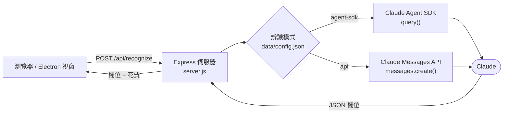

<div align="center">

# 📄 Your DocumentRecognizer 文件辨識器

**拍下文件，立刻得到整齊的欄位表格 —— 由 Claude 驅動。**

載入工單、出貨單、收貨單、發票或收據的照片或掃描檔，按一下 **辨識**，<br>
頁面上每一組「欄位 : 數值」都會整理成清楚的表格。

[English](README.md) · **繁體中文**

<p>
  
  
  
  
  <a href="LICENSE"></a>
</p>


<sub>辨識範例出貨單（虛構資料）</sub>

</div>

## ✨ 功能特色

- **圖片一鍵變表格** —— 各種文件照片或掃描檔都適用：工單、出貨單、收貨單、發票、收據……
- **兩種呼叫 Claude 的方式** —— 透過 **Claude Agent SDK** 使用你的 Claude 訂閱，或透過 Messages API 使用自己的 **API Key**；切換後下一次辨識立即生效。
- **內建花費統計** —— 今日與累計 API 花費直接顯示在頁首。
- **網頁或桌面皆可** —— `npm start` 以本機網頁執行，`npm run electron` 以桌面視窗開啟。
- **資料留在本機** —— 設定與花費紀錄存放在已被 git 忽略的 `data/` 資料夾，上傳的圖片辨識完立即刪除，API Key 在畫面上只顯示遮罩。
- **輕巧好改** —— Express 加原生 JavaScript，免建置；整段辨識提示詞集中在一個常數裡。

## 🧭 運作方式



1. 前端把圖片上傳到 `/api/recognize`（僅接受圖片，上限 15 MB），暫存於 `uploads/`。
2. 伺服器每次請求都會重新讀取 `data/config.json`（因此切換模式立即生效），再把圖片連同辨識提示詞交給 Claude。
3. 要求 Claude 只回傳 `{"fields":[{"category":"…","value":"…"}]}`；解析時也能容錯 Markdown 程式碼圍欄，以及 JSON 前後多餘的文字。
4. 伺服器回傳欄位與最新花費，前端渲染表格，並刪除暫存圖檔。

## 🚀 快速開始

### 環境需求

- [Node.js](https://nodejs.org/) **18 以上**
- 以下擇一：
  - 本機已安裝並登入 **Claude Code** —— 用於 *Agent SDK* 模式（預設）
  - **Anthropic API Key** —— 用於 *API* 模式

### 安裝

```bash
git clone https://github.com/weitaichen/Your_DocumentRecognizer.git
cd Your_DocumentRecognizer
npm install
```

### 啟動

| | 指令 | 接著 |
| --- | --- | --- |
| 🌐 **網頁模式** | `npm start` | 開啟 <http://localhost:3000> |
| 🖥️ **桌面模式** | `npm run electron` | 自動開啟桌面視窗 |

桌面外殼（[`electron-main.js`](electron-main.js)）會在同一個程序內啟動伺服器。若 3000 埠已被占用：該埠上跑的若是本 App 就直接沿用，否則改用系統指派的空閒埠。

## 📖 使用方式

1. 按 **載入圖檔** 選擇文件圖片，左側會顯示預覽。
2. 按 **辨識**，稍候數秒，右側表格就會列出 **類別** / **數值**。
3. 頁首會顯示 **今日 API 花費**、**全部 API 花費** 與 **目前模式**。

> [!TIP]
> 欄位名稱預設以繁體中文輸出。若要改成其他語言或調整抽取內容，請修改 [`server.js`](server.js) 中的 `PROMPT` 常數。

## 🔀 辨識模式

點右上角 **⚙ 設定** 選擇 App 與 Claude 溝通的方式。設定會存到 `data/config.json`，重新啟動後仍會保留。

| | Claude Agent SDK *（預設）* | Claude API |
| --- | --- | --- |
| **驗證方式** | 本機 Claude Code 登入 | 你自己的 API Key |
| **計費** | Claude 訂閱額度 | 依 token 計費 |
| **花費統計** | 不計入（維持 $0） | 每次請求估算 |
| **使用套件** | `@anthropic-ai/claude-agent-sdk` | `@anthropic-ai/sdk` |

- **Claude Agent SDK** 沿用本機 Claude Code 的登入，不需要 API Key。每次呼叫前，伺服器都會把 `ANTHROPIC_API_KEY` 從 SDK 的環境變數中移除，因此已儲存或殘留的金鑰絕不會讓你在不知情下改走 token 計費。此模式下伺服器 log 會為每次請求印出 `apiKeySource=…`，方便確認。
- **Claude API** 使用你在設定頁貼上的金鑰（`sk-ant-…`）。金鑰只存在 `data/config.json`，不會寫入環境變數或 log，畫面上也只顯示遮罩後的片段。

<div align="center">

</div>

## 💰 花費統計

- **API 模式** —— Messages API 只回傳 token 用量、不回傳金額，因此以 [`pricing.js`](pricing.js) 中「每百萬 token」的單價估算，依模型名稱前綴比對（未知模型以輸入 $15 / 輸出 $75 計）。快取建立與快取讀取的 token 都以輸入單價計算。以上皆為估算值，官方調價時請自行更新單價表。
- **Agent SDK 模式** —— 使用訂閱額度，不計入花費。
- 花費依本機日期記錄在 `data/costs.json`，並保留累計總額。

## ⚙️ 設定

| 環境變數 | 預設值 | 說明 |
| --- | --- | --- |
| `PORT` | `3000` | 本機伺服器埠號 |
| `RECOGNIZER_MODEL` | `claude-opus-4-8` | 兩種模式共用的 Claude 模型 |

```bash
# macOS / Linux
PORT=8080 RECOGNIZER_MODEL=claude-sonnet-5 npm start
```

```powershell
# Windows（PowerShell）
$env:PORT = "8080"; $env:RECOGNIZER_MODEL = "claude-sonnet-5"; npm start
```

### 本機檔案

App 寫出的所有檔案都只留在你的電腦上，並已被 `.gitignore` 排除：

| 路徑 | 內容 |
| --- | --- |
| `data/config.json` | 辨識模式與 API Key |
| `data/costs.json` | 每日與累計的估算花費 |
| `uploads/` | 暫存上傳檔，每次請求後刪除 |
| `electron-error.log` | 桌面版啟動錯誤紀錄 |

## 🔌 HTTP API

前端只是這四個 JSON 端點的輕量介面，你也可以在自己的程式中直接呼叫：

| 方法 | 端點 | 說明 |
| --- | --- | --- |
| `POST` | `/api/recognize` | multipart 上傳，欄位名稱為 `image` → `{ fields, mode, costs }` |
| `GET` | `/api/settings` | 目前模式與遮罩後的金鑰 → `{ mode, hasApiKey, apiKeyMasked }` |
| `POST` | `/api/settings` | 儲存 `{ mode: "agent-sdk" \| "api", apiKey? }`；省略 `apiKey` 則沿用已儲存的金鑰 |
| `GET` | `/api/costs` | 以美元計的花費 → `{ date, today, total }` |

```bash
curl -F "image=@delivery-note.jpg" http://localhost:3000/api/recognize
```

```json
{
  "fields": [
    { "category": "單號", "value": "DN-2026-0913" },
    { "category": "收貨單位", "value": "範例製造股份有限公司" }
  ],
  "mode": "agent-sdk",
  "costs": { "date": "2026-09-13", "today": 0, "total": 0 }
}
```

## 🗂️ 專案結構

```text
Your_DocumentRecognizer/
├── server.js          # Express 伺服器：上傳、辨識、設定與花費 API
├── store.js           # 將設定與花費紀錄存到 data/
├── pricing.js         # API 模式花費估算用的 token 單價表
├── electron-main.js   # 桌面外殼：啟動伺服器並開啟視窗
├── public/
│   ├── index.html     # 主頁：預覽、結果表格、花費列
│   ├── app.js
│   ├── settings.html  # 設定頁：辨識模式與 API Key
│   ├── settings.js
│   └── style.css
└── docs/images/       # README 截圖
```

## 🔒 隱私與安全

- 圖片會傳送給 Claude（Anthropic）進行辨識；App 本身沒有任何分析或遙測。
- API Key 以明文存於 `data/config.json`，請妥善保管該資料夾（已被 git 忽略）。
- 伺服器沒有身分驗證，設計上僅供本機單人使用，請勿將埠號暴露在不受信任的網路上。
- Agent SDK 模式下，代理以 `permissionMode: "bypassPermissions"` 執行。文件中暗藏的指令可能影響它的行為，因此請只辨識你信任的文件。

## 🛠️ 疑難排解

<details>
<summary><b>3000 埠已被占用（<code>EADDRINUSE</code>）</b></summary>
<br>

關閉占用該埠的程式，或用 `PORT` 環境變數改用其他埠（見上方「設定」）。桌面模式會自動處理這個情況。
</details>

<details>
<summary><b>Agent SDK 模式驗證失敗</b></summary>
<br>

確認本機已安裝並登入 Claude Code（執行一次 `claude` 並完成登入）後再試。伺服器 log 會為每次 Agent SDK 請求顯示 `apiKeySource=…`。
</details>

<details>
<summary><b>「尚未設定 API Key，請到設定頁輸入」</b></summary>
<br>

目前是 API 模式，但尚未儲存金鑰。請到 **⚙ 設定** 輸入，或切回 Claude Agent SDK。
</details>

<details>
<summary><b>上傳被拒絕，或圖片無法辨識</b></summary>
<br>

只接受 15 MB 以內的圖片檔，且 Claude 支援 JPEG、PNG、GIF 與 WebP。HEIC、TIFF 等格式請先轉檔。
</details>

<details>
<summary><b>「辨識失敗」</b></summary>
<br>

通常是模型的回覆不是合法 JSON。原始回覆會印在伺服器 log，並以 `raw` 欄位附在錯誤回應中。重試一次，或改用更清晰、光線充足的照片，通常就能解決。
</details>

## 🧰 使用技術

[Claude Agent SDK](https://www.npmjs.com/package/@anthropic-ai/claude-agent-sdk) · [Anthropic TypeScript SDK](https://www.npmjs.com/package/@anthropic-ai/sdk) · [Express](https://expressjs.com/) · [Multer](https://github.com/expressjs/multer) · [Electron](https://www.electronjs.org/)

## 📄 授權

本專案採用 [Apache License 2.0](LICENSE) 授權。
